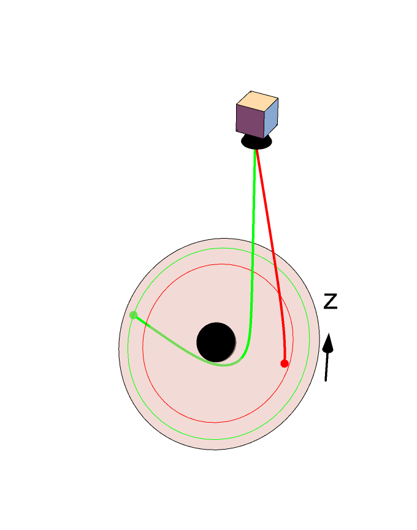

<a id="readme-top"></a>
<!-- PROJECT LOGO -->
<br />
<div align="center">
  <a href="https://github.com/AdamField118/Blackhole-in-Python">
    
  </a>

<h3 align="center">How to Code a Blackhole in Python</h3>

  <p align="center">
    Let's use python and matplotlib to gain an intuition for coding difficult physics problems! Thank you to my advisor Dominic Chang at Harvard BHI for making and teaching me how to do this.
    <br />
    <a href="https://blog.devgenius.io/how-to-draw-a-blackhole-in-python-e674b831431a"><strong>Source Material »</strong></a>
  </p>
</div>

<!-- TABLE OF CONTENTS -->
<details>
  <summary>Table of Contents</summary>
  <ol>
    <li>
      <a href="#about-the-project">About The Project</a>
      <ul>
        <li><a href="#built-with">Built With</a></li>
      </ul>
    </li>
    <li>
      <a href="#getting-started">Getting Started</a>
      <ul>
        <li><a href="#set-up">Set-up</a></li>
      </ul>
    </li>
    <li><a href="#pseudocode">Pseudocode</a></li>
    <li><a href="#breakdown-of-code">Breakdown of Code</a></li>
    <li><a href="#contact">Contact</a></li>
  </ol>
</details>


<!-- ABOUT THE PROJECT -->
## About The Project

This mini lecture is made to guide you through the process of coding a black hole in python but also to gain a more fundamental way of thinking when trying to code a physics problem. 

My goal is that you are able to comment the code provided on your own, knowing what the functons do conceptually, along with feeling more confident with coding physical systems.

<p align="right">(<a href="#readme-top">back to top</a>)</p>


### Built With

* [![Python][Python.py]][Python-url]
* [![Jupyter][Jupyter.ipynb]][Jupyter-url]

<p align="right">(<a href="#readme-top">back to top</a>)</p>


<!-- GETTING STARTED -->
## Getting Started

Go into 'src', there you'll have the choice of a jupyter notebook or regular python file.
I suggest clicking the badge above for Jupyter notebook and importing the .ipynb file into that, since WPI gives us JupyterHub!
I've included the notes below in the .ipynb file, so if you want everything in one place I highly suggest that.

### Set-up
Either use the Jupyter Hub link for WPI, or make sure you have python downloaded. You can easily make sure you have python, or any other program downloaded by typing,
```sh
python -V
```
, this should return the latest version of python.

This is an example of how to list things you need to use the software and how to install them.
Once you have the python, run command prompt as administrator and type of following code.
* scipy
  ```sh
  pip install scipy
  ```
* matplotlib
  ```sh
  pip install matplotlib
  ```

<!-- Pseudocode -->
## Pseudocode

So we want to trace rays from uniform rings in the bulk space of a black hole to our observer.
<div align=centering>
  <image >
</div>

- [ ] Step 1
- [ ] Step 2
- [ ] Step 3
    - [ ] Details

<p align="right">(<a href="#readme-top">back to top</a>)</p>

<!-- Breakdown of Code -->
## Breakdown of Code

Use this space to show useful examples of how a project can be used. Additional screenshots, code examples and demos work well in this space. You may also link to more resources.

_For more examples, please refer to the [Documentation](https://example.com)_

<p align="right">(<a href="#readme-top">back to top</a>)</p>

<!-- CONTACT -->
## Contact

Adam Field - adfield@wpi.edu

Project Link: [https://github.com/AdamField118/Blackhole-in-Python](https://github.com/AdamField118/Blackhole-in-Python)

<p align="right">(<a href="#readme-top">back to top</a>)</p>


<!-- MARKDOWN LINKS & IMAGES -->
<!-- https://www.markdownguide.org/basic-syntax/#reference-style-links -->

[Python.py]: https://img.shields.io/badge/python-3670A0?style=for-the-badge&logo=python&logoColor=ffdd54
[Python-url]: https://python.org 
[Jupyter.ipynb]: https://img.shields.io/badge/Jupyter-notebook-orange
[Jupyter-url]: https://jupyterhub.wpi.edu/